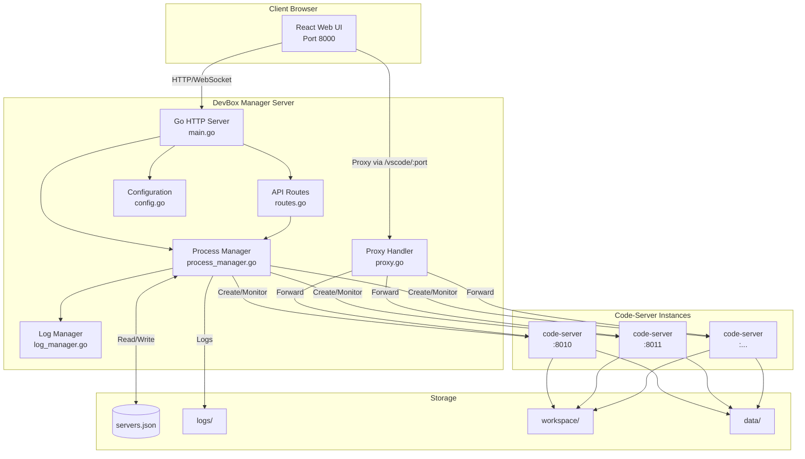
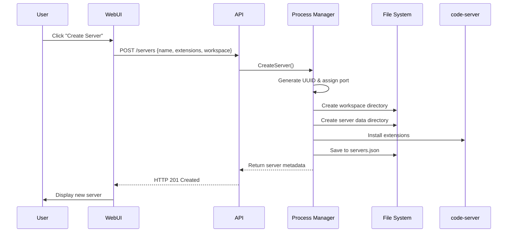
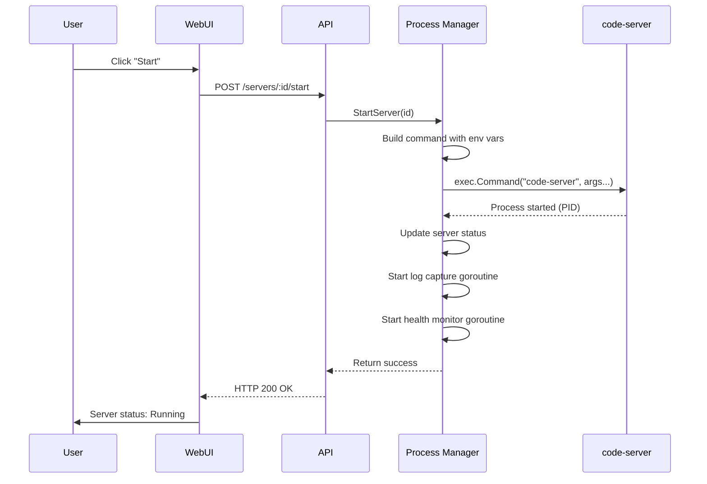
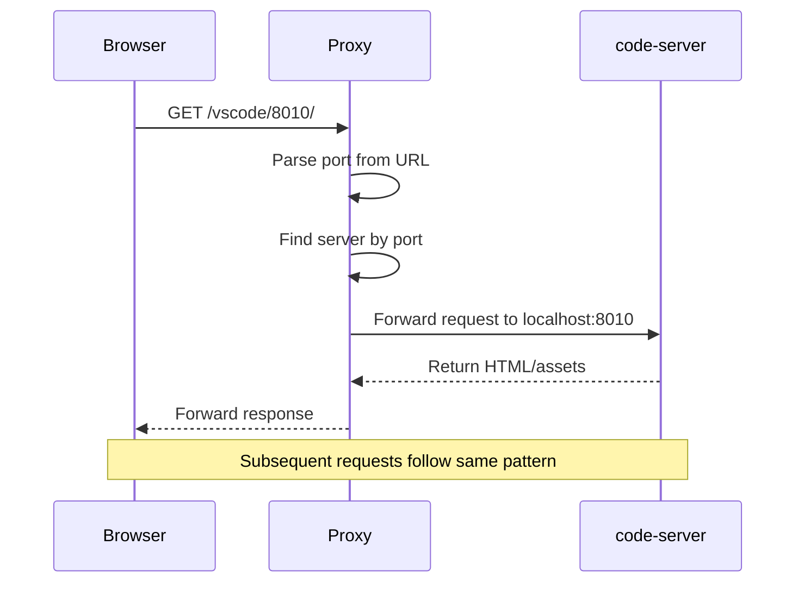
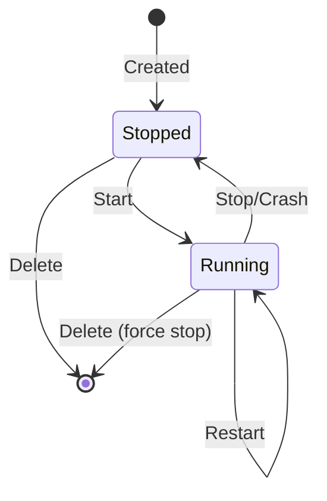

# Architecture Overview

Databricks DevBox is a three-tier architecture consisting of a Go-based server, a React web UI, and managed code-server instances.

## System Architecture



## Component Overview

### 1. Go Server (`databricks_devbox_go/`)

The core server written in Go using the Gin framework. Responsibilities:

- **HTTP Server**: Serves the web UI and API endpoints
- **Process Management**: Creates, starts, stops, and monitors code-server instances
- **Configuration**: Loads and manages `devbox.yaml` configuration
- **Proxying**: Routes requests to appropriate code-server instances
- **Logging**: Centralized log management with WebSocket streaming
- **Health Monitoring**: Tracks server health, CPU, memory, and uptime

**Key Files:**

- `main.go` - Entry point, server initialization
- `process_manager.go` - Process lifecycle management
- `routes.go` - API endpoint definitions
- `config.go` - Configuration loading and validation
- `proxy.go` - HTTP proxy for code-server instances
- `log_manager.go` - Log aggregation and streaming

### 2. Python Wrapper (`app/`)

Python application that wraps the Go server for Databricks App deployment.

**Key Files:**

- `app.py` - Main entry point, downloads and starts Go server
- `vibe_code.py` - Sets up vibe coding tools (Claude Code, CCR, etc.)
- `version.py` - Version management and GitHub releases
- `app.yaml` - Databricks App configuration
- `devbox.yaml` - DevBox configuration (extensions, templates)

### 3. Web UI (`web_ui/`)

React-based single-page application built with Vite, TypeScript, and Tailwind CSS.

**Features:**

- Server creation and management
- Real-time status monitoring
- Log streaming via WebSocket
- Template selection
- Extension group configuration

## Request Flow

### Creating a Server



### Starting a Server



### Accessing code-server



## Data Flow

### Configuration Loading

```
1. main.go starts
2. InitializeConfig() called
3. Read DEVBOX_CONFIG_PATH env var (default: app/devbox.yaml)
4. Parse YAML into DevboxConfig struct
5. Validate and fill defaults
6. Store in global config variable
7. Available to all components via GetConfig()
```

### Server Persistence

```
1. Server created/modified
2. ProcessManager.saveServers() called
3. Marshal servers map to JSON
4. Write to data/servers.json
5. On restart: loadServers() reads JSON
6. Rebuild in-memory state
7. Resume health monitoring
```

### Log Streaming

```
1. code-server process starts
2. Capture stdout/stderr pipes
3. LogManager receives logs
4. Store in memory ring buffer
5. WebSocket clients subscribe
6. Broadcast logs to all connected clients
7. HTTP API serves recent logs
```

## Process Lifecycle

### Server States



### Health Monitoring

Every 30 seconds, for each running server:

1. Check if PID exists
2. Make HTTP request to `http://localhost:<port>/healthz`
3. Verify response status is 200 and body contains `{"status": "alive"}`
4. Update metrics (CPU, memory, uptime)
5. If check fails, mark server as stopped

### Auto-Recovery

Servers are **not** automatically restarted on crash. This is intentional:

- Prevents infinite crash loops
- Allows inspection of crash state
- User decides whether to restart

## Port Management

### Port Allocation

```python
nextPort = 8500  # Start from 8500
portMap = {}     # Maps port → server_id

def getNextAvailablePort():
    while nextPort in portMap:
        nextPort++
    portMap[nextPort] = ""  # Reserve
    return nextPort
```

### Port Range

- **Manager Server**: 8000 (or `DEVBOX_SERVER_PORT`)
- **code-server Instances**: 8010-8100 (configurable in devbox.yaml)
- **Default Start**: 8500 (historical reasons, configurable via code)

## Security Model

### Authentication

- **Databricks App**: Uses Databricks SSO
- **Local**: No authentication (development only)
- **code-server**: `--auth none` (protected by DevBox proxy)

### Isolation

- **Workspaces**: Each server has isolated workspace directory
- **Data**: Separate data directory per server (`data/<server-id>/`)
- **Logs**: Isolated log files per server
- **Processes**: Independent code-server processes

### Token Management

For vibe coding tools (Claude Code, CCR):

1. Generate token via `WorkspaceClient().tokens.create()`
2. Store in CCR configuration
3. Auto-refresh on expiry (configured via `CLAUDE_CODE_TOKEN_EXPIRY_SECONDS`)

## Scalability

### Current Limits

- **Concurrent Servers**: Limited by available ports (default: 90 ports from 8010-8100)
- **Memory**: Each code-server instance uses ~200-500 MB
- **CPU**: Depends on workload in each instance

### Optimization Strategies

- Use shared extension cache (XDG_DATA_HOME per server)
- Limit concurrent server starts
- Implement server hibernation for idle instances
- Use server pools for common configurations

## Next Steps

<div class="grid cards" markdown>

- **[Go Binary Details →](go-binary.md)**

    Deep dive into Go components

- **[Process Management →](process-management.md)**

    How code-server instances are managed

- **[Web UI →](web-ui.md)**

    Frontend architecture

</div>