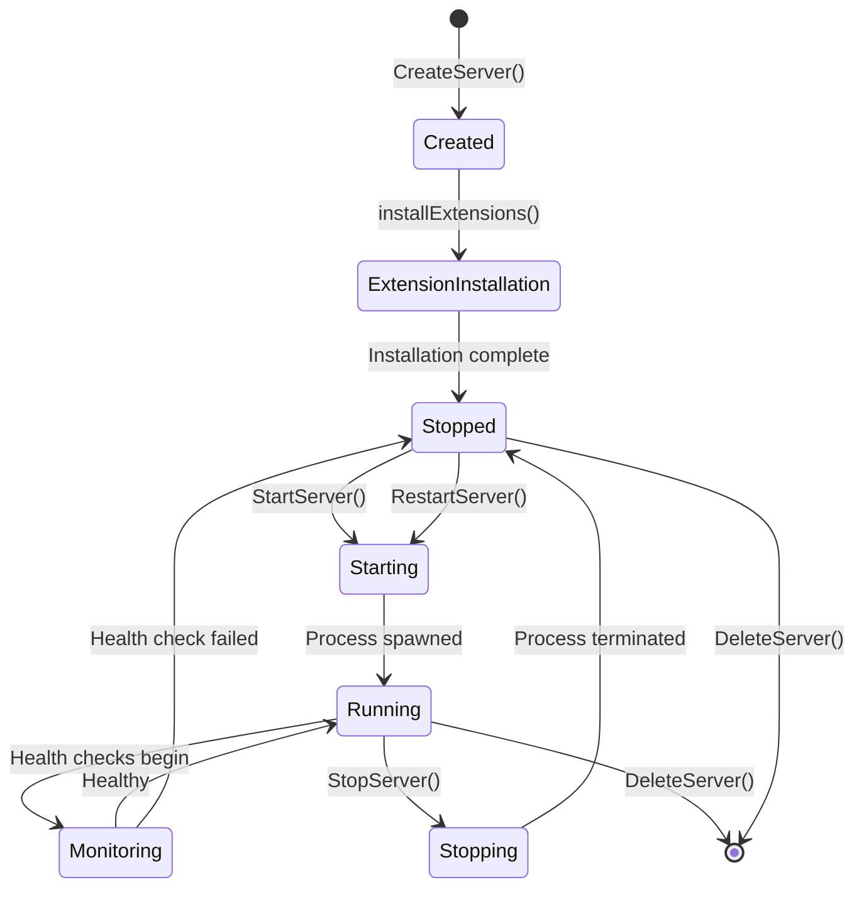

# Process Management

Deep dive into how Databricks DevBox manages code-server processes throughout their lifecycle.

## Process Lifecycle



## Server Creation Flow

### 1. Metadata Creation

```go
// process_manager.go:131
func (pm *ProcessManager) CreateServer(name, workspacePath string, extensions []string, zipFile, githubURL string) (*ServerInstance, error) {
    // Generate unique ID
    id := uuid.New().String()

    // Assign available port
    port := pm.getNextAvailablePort()  // Starts from 8500

    // Create workspace directory
    if workspacePath == "" {
        workspacePath = filepath.Join("workspace", id)
    }
    absWorkspacePath, _ := filepath.Abs(workspacePath)
    os.MkdirAll(absWorkspacePath, 0755)

    // Create server data directory
    serverDataDir := filepath.Join(pm.dataDir, id)  // data/<server-id>
    os.MkdirAll(serverDataDir, 0755)

    // Create server instance
    server := &ServerInstance{
        ID:            id,
        Name:          name,
        Port:          port,
        WorkspacePath: absWorkspacePath,
        Extensions:    extensions,
        Status:        StatusStopped,  // Not started yet
    }

    // Store in memory and persist
    pm.servers[id] = server
    pm.portMap[port] = id
    pm.saveServers()

    return server, nil
}
```

### 2. Workspace Initialization

**From ZIP file:**

```go
// process_manager.go:693
func (pm *ProcessManager) extractZipFile(zipPath, targetPath string) error {
    reader, _ := zip.OpenReader(zipPath)
    defer reader.Close()

    for _, file := range reader.File {
        // Sanitize path (prevent directory traversal)
        if strings.Contains(file.Name, "..") {
            continue
        }

        filePath := filepath.Join(targetPath, file.Name)

        if file.FileInfo().IsDir() {
            os.MkdirAll(filePath, file.FileInfo().Mode())
        } else {
            // Extract file
            fileReader, _ := file.Open()
            targetFile, _ := os.Create(filePath)
            io.Copy(targetFile, fileReader)
            targetFile.Close()
            fileReader.Close()
        }
    }

    return nil
}
```

**From GitHub:**

```go
// process_manager.go:739
func (pm *ProcessManager) cloneGithubRepo(repoURL, targetPath string) error {
    cmd := exec.Command("git", "clone", repoURL, targetPath)
    return cmd.Run()
}
```

### 3. Extension Installation

**Synchronous installation** (blocks server creation until complete):

```go
// process_manager.go:777
func (pm *ProcessManager) installExtension(env []string, extensionID, serverID, serverName string) bool {
    cmd := exec.Command("code-server", "--install-extension", extensionID)
    cmd.Env = env  // Must include XDG_DATA_HOME

    stdout, err := cmd.Output()
    if err != nil {
        pm.logger.LogProcessEvent(serverID, serverName, "EXTENSION_INSTALL_FAILED", err.Error())
        return false
    }

    pm.logger.LogProcessEvent(serverID, serverName, "EXTENSION_INSTALLED", extensionID)
    return true
}
```

**Environment for extension installation:**

```go
env := os.Environ()
userDataDir := filepath.Join(pm.dataDir, serverID)  // data/<server-id>
absDataDir, _ := filepath.Abs(userDataDir)

env = append(env,
    fmt.Sprintf("XDG_DATA_HOME=%s", absDataDir),  // Tells code-server where to install
)
```

**User settings application:**

After extensions are installed, apply user settings from `devbox.yaml`:

```go
// process_manager.go:1287
func (pm *ProcessManager) applyUserSettings(serverID string, installedExtensions []string) error {
    config := GetConfig()

    // Collect user settings from extension groups
    userSettings := make(map[string]interface{})
    for groupName, group := range config.ExtensionGroups {
        if group.UserSettings != nil {
            // Merge settings
            for key, value := range group.UserSettings {
                userSettings[key] = value
            }
        }
    }

    // Write to settings.json
    settingsFile := filepath.Join(pm.dataDir, serverID, "code-server", "User", "settings.json")
    data, _ := json.MarshalIndent(userSettings, "", "  ")
    os.WriteFile(settingsFile, data, 0644)

    return nil
}
```

## Starting a Server

### 0. Port Cleanup (Pre-start)

Before starting a server, the system automatically kills any existing process on the target port:

```go
// process_manager.go:131
func (pm *ProcessManager) killProcessOnPort(port int) error {
    // Use lsof to find the process using the port
    cmd := exec.Command("lsof", "-ti", fmt.Sprintf(":%d", port))
    output, err := cmd.Output()
    if err != nil {
        // No process found on port (which is fine)
        return nil
    }

    // Parse PIDs from output (one per line)
    pidStr := strings.TrimSpace(string(output))
    if pidStr == "" {
        return nil
    }

    // Split by newlines in case multiple processes are on the port
    pids := strings.Split(pidStr, "\n")
    for _, pidLine := range pids {
        pidLine = strings.TrimSpace(pidLine)
        if pidLine == "" {
            continue
        }

        // Kill the process with SIGKILL
        killCmd := exec.Command("kill", "-9", pidLine)
        if err := killCmd.Run(); err != nil {
            log.Printf("Failed to kill process %s on port %d: %v", pidLine, port, err)
        } else {
            log.Printf("Killed existing process %s on port %d", pidLine, port)
        }
    }

    return nil
}
```

**When this happens:**

- User clicks the play button to start a code-server
- System checks if any process is listening on the assigned port
- If a process exists, it's forcefully terminated with `kill -9`
- If no process exists, the system continues normally
- The code-server then starts on the now-free port

**Use cases:**

- **Stale processes**: A previous code-server instance didn't shut down cleanly
- **Port conflicts**: Another application is using the port
- **Development**: You manually started a process on the port for testing

### 1. Build Command and Environment

```go
// process_manager.go:239
func (pm *ProcessManager) StartServer(id string) error {
    server := pm.servers[id]

    // Kill any existing process on the port before starting
    if err := pm.killProcessOnPort(server.Port); err != nil {
        log.Printf("Warning: Failed to kill existing process on port %d: %v", server.Port, err)
        // Continue anyway - the port might just be free
    }

    // Create config directory
    userDataDir := filepath.Join(pm.dataDir, id)
    configDir := filepath.Join(userDataDir, "code-server")
    os.MkdirAll(configDir, 0755)

    // Build command
    args := []string{
        "--bind-addr", fmt.Sprintf("0.0.0.0:%d", server.Port),
        "--user-data-dir", configDir,
        "--auth", "none",
        "--disable-telemetry",
        "--disable-update-check",
        "--disable-file-downloads",
        "--log", "info",
        server.WorkspacePath,
    }

    cmd := exec.Command("code-server", args...)
    cmd.Dir = server.WorkspacePath

    // Set environment
    env := os.Environ()
    absDataDir, _ := filepath.Abs(userDataDir)

    env = append(env,
        fmt.Sprintf("XDG_DATA_HOME=%s", absDataDir),
        "NODE_OPTIONS=--max-old-space-size=2048",
        "VSCODE_LOGS=info",
        "CODE_SERVER_LOG=info",
        "UV_THREADPOOL_SIZE=128",
        "NODE_TLS_REJECT_UNAUTHORIZED=0",
        "VSCODE_DISABLE_CRASH_REPORTER=true",
        "ELECTRON_NO_ATTACH_CONSOLE=1",
        "DISABLE_TELEMETRY=true",
    )
    cmd.Env = env

    // Start process
    return cmd.Start()
}
```

### 2. Output Capture

```go
// Get stdout/stderr pipes
stdout, _ := cmd.StdoutPipe()
stderr, _ := cmd.StderrPipe()

// Start output capture in goroutine
outputCapture := NewEnhancedProcessOutputCapture(pm.logger, pm.logManager, id, serverName)
go outputCapture.CaptureOutput(stdout, stderr)
```

### 3. Update Server State

```go
// Update metadata
now := time.Now()
server.PID = &cmd.Process.Pid
server.StartTime = &now
server.Status = StatusRunning
server.Command = append([]string{"code-server"}, args...)

// Persist to disk
pm.saveServers()

// Start monitoring
go pm.monitorProcess(id, cmd)
```

## Process Monitoring

### Per-Process Monitor

Each running server has a dedicated goroutine:

```go
// process_manager.go:516
func (pm *ProcessManager) monitorProcess(id string, cmd *exec.Cmd) {
    // Wait for process to exit
    err := cmd.Wait()

    pm.mutex.Lock()
    defer pm.mutex.Unlock()

    server := pm.servers[id]

    if err != nil {
        log.Printf("Server %s exited with error: %v", server.Name, err)
        pm.logger.LogProcessEvent(id, server.Name, "PROCESS_EXITED_ERROR", err.Error())
        server.Status = StatusFailed
    } else {
        log.Printf("Server %s exited normally", server.Name)
        pm.logger.LogProcessEvent(id, server.Name, "PROCESS_EXITED", "Normal exit")
        server.Status = StatusStopped
    }

    server.PID = nil
    server.StartTime = nil
    pm.saveServers()
}
```

### Global Health Monitor

Single goroutine monitors all servers every 30 seconds:

```go
// process_manager.go:884
func (pm *ProcessManager) startHealthMonitor() {
    ticker := time.NewTicker(30 * time.Second)
    defer ticker.Stop()

    for range ticker.C {
        pm.performHealthCheck()
    }
}

func (pm *ProcessManager) performHealthCheck() {
    pm.mutex.Lock()
    defer pm.mutex.Unlock()

    for serverID, server := range pm.servers {
        if server.Status == StatusRunning && server.PID != nil {
            // Check HTTP health endpoint
            isHealthy := pm.isServerHealthy(server.Port)

            if !isHealthy {
                log.Printf("Health check failed for server %s", server.Name)
                server.Status = StatusStopped
                server.PID = nil
                server.StartTime = nil
                pm.saveServers()
            }
        }
    }
}
```

### Health Check Implementation

```go
// process_manager.go:951
func (pm *ProcessManager) isServerHealthy(port int) bool {
    client := &http.Client{
        Timeout: 3 * time.Second,
        CheckRedirect: func(req *http.Request, via []*http.Request) error {
            return http.ErrUseLastResponse  // Don't follow redirects
        },
    }

    // Wake up server with root request (ignore result)
    rootResp, _ := client.Get(fmt.Sprintf("http://localhost:%d/", port))
    if rootResp != nil {
        rootResp.Body.Close()
    }

    // Check health endpoint
    resp, err := client.Get(fmt.Sprintf("http://localhost:%d/healthz", port))
    if err != nil {
        return false
    }
    defer resp.Body.Close()

    if resp.StatusCode != http.StatusOK {
        return false
    }

    // Parse response
    var healthResponse struct {
        Status        string `json:"status"`
        LastHeartbeat int64  `json:"lastHeartbeat"`
    }
    json.NewDecoder(resp.Body).Decode(&healthResponse)

    return healthResponse.Status == "alive"
}
```

### Metrics Collection

Every second, update metrics for running servers:

```go
// process_manager.go:1000
func (pm *ProcessManager) updateServerMetrics() {
    now := time.Now()

    for _, server := range pm.servers {
        if server.Status != StatusRunning || server.PID == nil {
            // Clear metrics for non-running servers
            server.Uptime = nil
            server.CPUPercent = nil
            server.MemoryMB = nil
            continue
        }

        // Get process handle
        proc, err := process.NewProcess(int32(*server.PID))
        if err != nil {
            // Process doesn't exist
            server.Status = StatusStopped
            server.PID = nil
            continue
        }

        // Check if process exists
        exists, _ := proc.IsRunning()
        if !exists {
            server.Status = StatusStopped
            server.PID = nil
            continue
        }

        // Calculate uptime
        uptime := now.Sub(*server.StartTime).Seconds()
        server.Uptime = &uptime

        // Get CPU usage
        cpuPercent, _ := proc.CPUPercent()
        server.CPUPercent = &cpuPercent

        // Get memory usage
        memInfo, _ := proc.MemoryInfo()
        memoryMB := float64(memInfo.RSS) / 1024 / 1024
        server.MemoryMB = &memoryMB

        // Update timestamp
        server.LastUpdate = &now
    }
}
```

## Stopping a Server

### Graceful Shutdown

```go
// process_manager.go:357
func (pm *ProcessManager) StopServer(id string) error {
    server := pm.servers[id]

    if server.PID == nil {
        return fmt.Errorf("server not running")
    }

    // Find process
    proc, err := os.FindProcess(*server.PID)
    if err != nil {
        return err
    }

    // Send SIGTERM for graceful shutdown
    if err := proc.Signal(syscall.SIGTERM); err == nil {
        // Wait up to 10 seconds
        go func() {
            time.Sleep(10 * time.Second)

            pm.mutex.Lock()
            defer pm.mutex.Unlock()

            // Force kill if still running
            if server.PID != nil {
                if p, err := os.FindProcess(*server.PID); err == nil {
                    p.Kill()
                }
            }

            server.Status = StatusStopped
            server.PID = nil
            pm.saveServers()
        }()
    } else {
        // SIGTERM failed, force kill
        proc.Kill()
    }

    // Immediately mark as stopped
    server.Status = StatusStopped
    server.PID = nil
    server.StartTime = nil
    pm.saveServers()

    return nil
}
```

## Deleting a Server

### Complete Cleanup

```go
// process_manager.go:410
func (pm *ProcessManager) DeleteServer(id string) error {
    server := pm.servers[id]

    // Stop if running
    if server.Status == StatusRunning && server.PID != nil {
        proc, _ := os.FindProcess(*server.PID)
        proc.Kill()
    }

    // Clean up directories
    dataDir := filepath.Join(pm.dataDir, id)
    os.RemoveAll(dataDir)  // Remove data/<server-id>

    os.RemoveAll(server.WorkspacePath)  // Remove workspace

    logsDir := filepath.Join("logs", id)
    os.RemoveAll(logsDir)  // Remove logs/<server-id>

    // Remove from maps
    delete(pm.portMap, server.Port)
    delete(pm.servers, id)

    // Persist
    pm.saveServers()

    return nil
}
```

## State Persistence

### Save State

```go
// process_manager.go:679
func (pm *ProcessManager) saveServers() {
    data, _ := json.MarshalIndent(pm.servers, "", "  ")
    os.WriteFile(pm.serversFile, data, 0644)  // data/servers.json
}
```

### Load State

```go
// process_manager.go:652
func (pm *ProcessManager) loadServersFromFile() {
    data, _ := os.ReadFile(pm.serversFile)

    var servers map[string]*ServerInstance
    json.Unmarshal(data, &servers)

    // Restore in-memory state
    pm.servers = servers
    pm.portMap = make(map[int]string)

    // Rebuild port map
    for id, server := range servers {
        pm.portMap[server.Port] = id
        if server.Port >= pm.nextPort {
            pm.nextPort = server.Port + 1
        }
    }
}
```

### State Refresh

Every second, reload state from disk to catch external changes:

```go
// process_manager.go:821
func (pm *ProcessManager) startStateRefreshRoutine() {
    ticker := time.NewTicker(1 * time.Second)
    defer ticker.Stop()

    for range ticker.C {
        pm.refreshStateFromFile()
    }
}
```

## Concurrency & Thread Safety

### Locking Strategy

```go
// Read operations
pm.mutex.RLock()
server := pm.servers[id]
pm.mutex.RUnlock()

// Write operations
pm.mutex.Lock()
pm.servers[id] = newServer
pm.saveServers()
pm.mutex.Unlock()
```

### Goroutine Management

- **1 global health monitor** (all servers)
- **1 global state refresher** (all servers)
- **N process monitors** (1 per running server)
- **N log capture goroutines** (1 per running server)

## Next Steps

<div class="grid cards" markdown>

- **[Web UI →](web-ui.md)**

    Frontend architecture

- **[Configuration →](../configuration/devbox-yaml.md)**

    Configuration reference

</div>