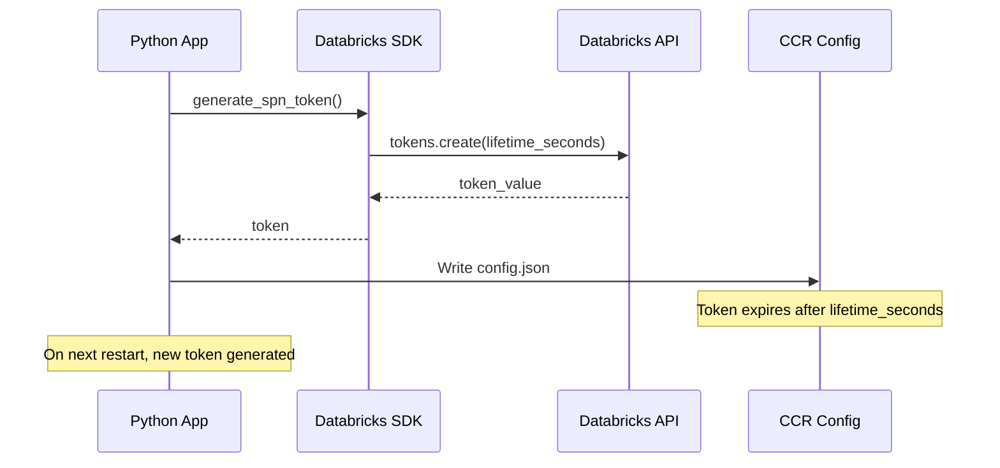

# Token Management

Databricks DevBox uses Databricks Personal Access Tokens (PATs) to authenticate with Databricks-hosted AI models for vibe coding assistants.

## Token Generation

Tokens are automatically generated using the Databricks SDK when the app starts.

### How It Works

```python
# app/vibe_code.py:11
def generate_spn_token(duration_seconds = 3600):
    w = WorkspaceClient()
    token_expiry = int(os.environ.get("CLAUDE_CODE_TOKEN_EXPIRY_SECONDS", duration_seconds))
    token = w.tokens.create(
        comment=f"sdk-{time.time_ns()}",
        lifetime_seconds=token_expiry
    ).token_value
    return token
```

**Process:**

1. `WorkspaceClient()` authenticates using Databricks App credentials
2. Creates a new token via Databricks API
3. Token has configurable expiry (default: 3600 seconds = 1 hour)
4. Token stored in CCR (Claude Code Router) configuration

### Configuration

Set token expiry via environment variable:

```yaml
# app.yaml
env:
  - name: 'CLAUDE_CODE_TOKEN_EXPIRY_SECONDS'
    value: '7200'  # 2 hours
```

## Token Storage

Tokens are stored in the CCR configuration file:

```
~/.claude-code-router/config.json
```

**Configuration structure:**

```json
{
  "Providers": [
    {
      "name": "databricks",
      "api_base_url": "https://<workspace>/serving-endpoints/databricks-claude-sonnet-4/invocations",
      "api_key": "<generated-token>",
      "models": ["databricks-claude-sonnet-4"]
    }
  ]
}
```

## Token Lifecycle



### Expiry Handling

- **Automatic regeneration** on app restart
- **No refresh mechanism** during runtime (tokens must last for app lifetime)
- **Recommendation**: Set expiry longer than expected app uptime

## Security

### Token Permissions

Generated tokens have:

- ✅ **Read access** to Databricks workspace
- ✅ **Model serving endpoint** access
- ❌ **No write permissions** to workspace data
- ❌ **No admin permissions**

### Token Isolation

- Each app deployment generates its own token
- Tokens are not shared between environments
- Tokens stored in app filesystem (not version controlled)

## Usage

### Claude Code

Token is automatically used by Claude Code via CCR proxy:

```bash
# User runs
cc

# Behind the scenes:
# 1. Claude Code connects to CCR proxy
# 2. CCR forwards to Databricks endpoint with token
# 3. Response routed back to Claude Code
```

### Manual Token Access

For debugging or custom scripts:

```bash
# Read CCR config
cat ~/.claude-code-router/config.json | jq '.Providers[0].api_key'

# Use token with curl
TOKEN=$(cat ~/.claude-code-router/config.json | jq -r '.Providers[0].api_key')
curl -H "Authorization: Bearer $TOKEN" \
  https://<workspace>/serving-endpoints/databricks-claude-sonnet-4/invocations
```

## Troubleshooting

### Token Not Generated

**Symptoms:**

- Claude Code fails to connect
- CCR config missing or empty

**Solutions:**

1. Check Unity Catalog is enabled
2. Verify Databricks SDK authentication
3. Check app logs for token generation errors

```bash
# Check if token was generated
ls -la ~/.claude-code-router/config.json
cat ~/.claude-code-router/config.json | jq '.Providers'
```

### Token Expired

**Symptoms:**

- Claude Code works initially, then fails
- HTTP 401 errors from Databricks endpoint

**Solutions:**

1. Restart the app (generates new token)
2. Increase token expiry: `CLAUDE_CODE_TOKEN_EXPIRY_SECONDS=86400` (24 hours)

### Permission Denied

**Symptoms:**

- Token generation fails
- "Insufficient permissions" error

**Solutions:**

1. Ensure app has workspace access
2. Check Unity Catalog permissions
3. Verify Service Principal credentials

## Best Practices

### 1. Set Appropriate Expiry

```yaml
# For long-running apps (24 hours)
env:
  - name: 'CLAUDE_CODE_TOKEN_EXPIRY_SECONDS'
    value: '86400'

# For short-lived demos (1 hour)
env:
  - name: 'CLAUDE_CODE_TOKEN_EXPIRY_SECONDS'
    value: '3600'
```

### 2. Monitor Token Usage

Check CCR logs for token issues:

```bash
tail -f ~/.claude-code-router/plugin.log
```

### 3. Secure Token Storage

- ❌ **Never commit** config.json to version control
- ❌ **Never share** tokens between users
- ✅ **Generate fresh tokens** for each deployment

## Next Steps

<div class="grid cards" markdown>

- **[Databricks Integration →](databricks-integration.md)**

    How SDK authentication works

- **[Claude Code Router →](../coding-assistants/claude-code-router.md)**

    CCR configuration details

</div>