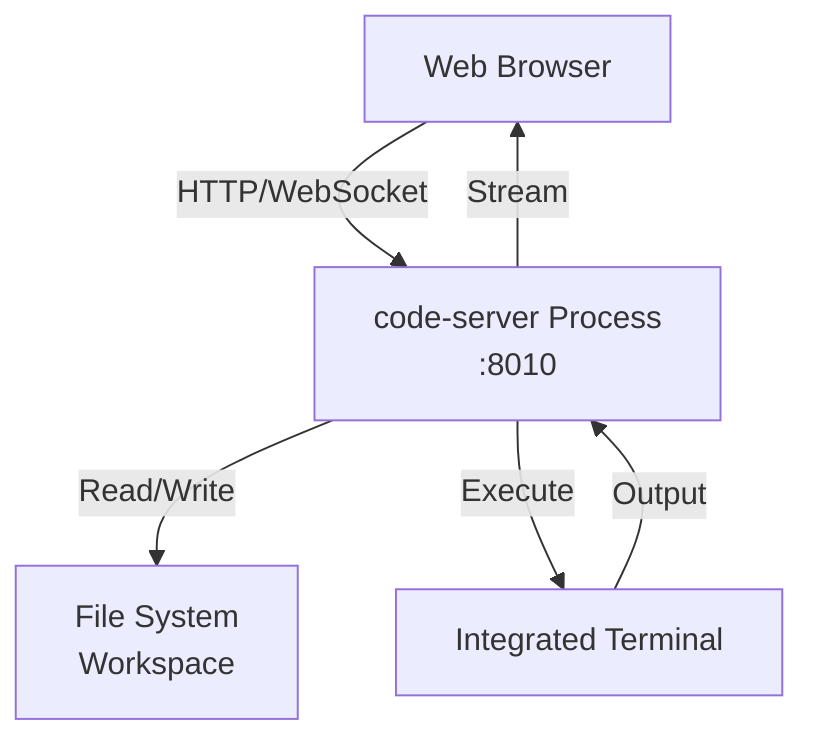

# What is code-server?

code-server is an open-source project that enables you to run VS Code in a browser, providing a full-featured development environment accessible from anywhere.

## Key Differences from VS Code Desktop

**code-server is NOT VS Code Desktop**. It's an open-source fork with important differences:

| Feature | VS Code Desktop | code-server |
|---------|-----------------|-------------|
| **Platform** | Desktop app | Web browser |
| **Installation** | Download installer | Server installation |
| **Extension Marketplace** | Microsoft Store | Open VSX |
| **Remote Access** | Limited | Built-in |
| **Licensing** | Microsoft | MIT License |
| **Telemetry** | Microsoft | Disabled by default |

## Why code-server?

### 1. **Browser-Based**

Access your development environment from any device:

- 💻 Laptop, desktop, tablet
- 🌐 Any operating system
- 📱 Even mobile devices (limited)
- ☁️ No local installation required

### 2. **Consistent Environments**

- **Same setup** across all machines
- **No "works on my machine"** issues
- **Share environments** with team members
- **Quick onboarding** for new developers

### 3. **Resource Flexibility**

- **Server-side execution**: Code runs on server, not local machine
- **Powerful backends**: Use cloud VMs with more resources
- **Thin clients**: Old laptops can access powerful development environments

### 4. **Always Available**

- **No setup time**: Environment is always running
- **Resume work**: Pick up exactly where you left off
- **Persistent state**: Terminal sessions, debug sessions remain active

## How It Works



**Flow:**

1. User accesses `http://localhost:8010` in browser
2. code-server serves VS Code web UI
3. User edits files in browser
4. code-server writes changes to server filesystem
5. Terminal commands execute on server
6. Output streams back to browser

## Open VSX vs Microsoft Marketplace

### Microsoft Marketplace

- ❌ **Not available** in code-server
- ❌ **Proprietary** to Microsoft VS Code
- ❌ **Licensing restrictions** prevent use in forks

### Open VSX Registry

- ✅ **Open source** extension registry
- ✅ **Available** to all VS Code forks
- ✅ **Most popular extensions** available
- ⚠️ **Some Microsoft extensions** not available

**Missing Extensions:**

- Microsoft Python Extension (alternatives available)
- Live Share (planned support)
- Some proprietary Microsoft tools

**Workarounds:**

- Use open-source alternatives
- Manually install compatible `.vsix` files
- Use Databricks DevBox pre-configured extension groups

[Learn more about extensions →](extension-marketplace.md)

## Architecture in Databricks DevBox

Databricks DevBox runs multiple code-server instances:

```
DevBox Manager (:8000)
├── code-server instance 1 (:8010)
├── code-server instance 2 (:8011)
└── code-server instance N (:8099)
```

Each instance:

- Runs as separate process
- Has isolated workspace directory
- Uses dedicated configuration
- Runs on unique port

[Learn more about architecture →](../architecture/process-management.md)

## Command Line Options

Databricks DevBox starts code-server with:

```bash
code-server \
  --bind-addr 0.0.0.0:8010 \
  --user-data-dir /path/to/data/<server-id>/code-server \
  --auth none \
  --disable-telemetry \
  --disable-update-check \
  --disable-file-downloads \
  --log info \
  /path/to/workspace
```

**Options explained:**

- `--bind-addr`: Listen on all interfaces, specific port
- `--user-data-dir`: Isolated configuration directory
- `--auth none`: No password (protected by DevBox)
- `--disable-telemetry`: No usage tracking
- `--disable-update-check`: Prevent automatic updates
- `--disable-file-downloads`: Security hardening
- `--log info`: Logging level

## Environment Variables

code-server instances run with:

```bash
XDG_DATA_HOME=/path/to/data/<server-id>
NODE_OPTIONS=--max-old-space-size=2048
VSCODE_LOGS=info
CODE_SERVER_LOG=info
UV_THREADPOOL_SIZE=128
NODE_TLS_REJECT_UNAUTHORIZED=0
VSCODE_DISABLE_CRASH_REPORTER=true
ELECTRON_NO_ATTACH_CONSOLE=1
DISABLE_TELEMETRY=true
```

[View code →](https://github.com/stikkireddy/databricks-devbox/blob/main/databricks_devbox_go/process_manager.go#L291-L302)

## Comparison with Alternatives

| Feature | code-server | Gitpod | GitHub Codespaces |
|---------|-------------|--------|-------------------|
| **Self-hosted** | ✅ Yes | ⚠️ Limited | ❌ No |
| **Cost** | Free | Paid | Paid |
| **Customization** | ✅ Full | ⚠️ Limited | ⚠️ Limited |
| **Databricks Integration** | ✅ Yes (via DevBox) | ❌ No | ❌ No |
| **Open Source** | ✅ Yes | ⚠️ Partial | ❌ No |

## Benefits in Databricks Context

### 1. **Lakehouse Integration**

- Access Databricks workspace files
- Run Databricks CLI commands
- Use Databricks extensions
- Query Unity Catalog

### 2. **Training & Workshops**

- **Pre-configured environments** for students
- **Consistent setup** across all participants
- **No installation** required
- **Quick teardown** after session

### 3. **AI-Assisted Development**

- **Claude Code** pre-installed and configured
- **Databricks models** via CCR
- **Token management** handled automatically

### 4. **Team Collaboration**

- **Shared templates** for common projects
- **Consistent tooling** across team
- **Easy environment reproduction**

## Limitations

### 1. **Not Identical to VS Code**

- Some keyboard shortcuts differ
- Performance may vary
- Browser limitations apply

### 2. **Extension Availability**

- Not all extensions available on Open VSX
- Microsoft-proprietary extensions unavailable
- Some extensions may have compatibility issues

### 3. **Network Dependency**

- Requires connection to server
- Latency affects responsiveness
- Offline work not possible

### 4. **Browser Constraints**

- Browser resource limits
- Tab closure loses state
- Browser-specific quirks

## Best Practices

### 1. **Use Modern Browsers**

- ✅ Chrome/Chromium
- ✅ Firefox
- ✅ Edge
- ⚠️ Safari (some issues)

### 2. **Stable Connections**

- Prefer wired connections
- Use stable WiFi
- Avoid mobile hotspots for intensive work

### 3. **Regular Saves**

- Enable auto-save
- Commit frequently
- Use version control

### 4. **Resource Management**

- Close unused terminals
- Limit concurrent processes
- Monitor memory usage

## Next Steps

<div class="grid cards" markdown>

- **[VS Code Differences →](vs-code-differences.md)**

    Detailed comparison

- **[Extension Marketplace →](extension-marketplace.md)**

    Open VSX vs Microsoft Store

- **[Architecture →](../architecture/index.md)**

    How DevBox manages code-server

</div>