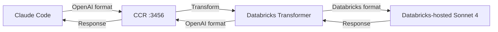
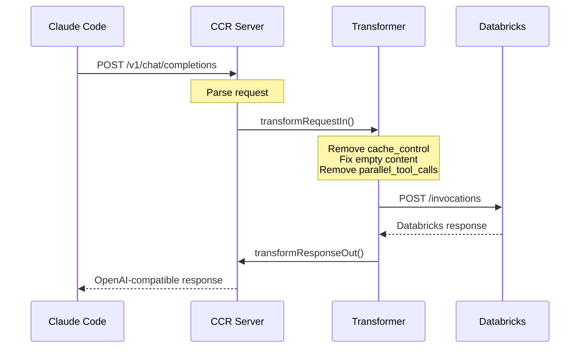

# Claude Code with Databricks Hosted Sonnet

Claude Code Router (CCR) is a proxy server that routes AI coding assistant requests to Databricks-hosted Claude models.

## Overview

CCR acts as a **transparent proxy** between Claude Code and Databricks-hosted Sonnet 4, enabling you to use Claude Code with Databricks-hosted models without requiring an Anthropic API subscription.

### Key Features

- ✅ **Request transformation**: Converts OpenAI format → Databricks format
- ✅ **Response transformation**: Converts Databricks format → OpenAI format
- ✅ **Token management**: Injects Databricks authentication tokens
- ✅ **Provider routing**: Routes to correct model endpoint
- ✅ **Automatic configuration**: Pre-configured in Databricks Devbox

## Using Claude Code with Databricks Managed Claude Models

### What You Get

When using Claude Code with CCR (Databricks-hosted):

- ✅ **No Anthropic subscription required** - Uses Databricks workspace authentication
- ✅ **Automatic installation** - Pre-configured when Databricks Devbox starts
- ✅ **Pre-authenticated** - Authentication is automatic when the Lakehouse App starts
- ✅ **Transparent proxy** - Claude Code works without code changes

### Limitations

- ❌ **No extended thinking support** - Keywords like `ultrathink`, `think`, and other thinking mode features are not available
- ❌ **Limited model options** - Only `databricks-claude-sonnet-4` is available
- ⚠️ **Databricks-specific** - Requires Databricks workspace with Claude model serving

### Model Details

- **Model**: `databricks-claude-sonnet-4`
- **Endpoint**: Databricks Model Serving
- **Version**: Claude Sonnet 4
- **Context**: 200K tokens

### Usage

```bash
# Run Claude Code (automatically uses CCR)
cc
```

Claude Code will automatically connect to CCR on `localhost:3456` and route requests to Databricks.

## Architecture



## Advanced

### Configuration File

Location: `~/.claude-code-router/config.json`

**Generated by `app/vibe_code.py:18-75`:**

```json
{
  "LOG": false,
  "LOG_LEVEL": "debug",
  "CLAUDE_PATH": "",
  "HOST": "127.0.0.1",
  "PORT": 3456,
  "APIKEY": "",
  "API_TIMEOUT_MS": "600000",
  "PROXY_URL": "",
  "transformers": [
    {
      "path": "/path/to/.claude-code-router/plugins/databricks-claude-transformers.js",
      "options": {
        "debug": false
      }
    }
  ],
  "Providers": [
    {
      "name": "databricks",
      "api_base_url": "https://<workspace>/serving-endpoints/databricks-claude-sonnet-4/invocations",
      "api_key": "<generated-token>",
      "models": ["databricks-claude-sonnet-4"],
      "transformer": {
        "use": ["OpenAI", "databricks-custom"],
        "databricks-claude-sonnet-4": {
          "use": ["OpenAI", "databricks-custom"]
        }
      }
    }
  ],
  "StatusLine": {
    "enabled": false,
    "currentStyle": "default",
    "default": { "modules": [] },
    "powerline": { "modules": [] }
  },
  "Router": {
    "default": "databricks,databricks-claude-sonnet-4"
  }
}
```

### Key Configuration Options

| Option | Description | Default |
|--------|-------------|---------|
| `HOST` | CCR bind address | `127.0.0.1` |
| `PORT` | CCR listen port | `3456` |
| `API_TIMEOUT_MS` | Request timeout | `600000` (10 min) |
| `Providers[].name` | Provider identifier | `databricks` |
| `Providers[].api_base_url` | Model endpoint | Databricks URL |
| `Providers[].api_key` | Auth token | Generated |
| `Router.default` | Default routing | `databricks,databricks-claude-sonnet-4` |

### Databricks Transformer

Custom transformer for Databricks API compatibility.

### Transformer Code

Location: `~/.claude-code-router/plugins/databricks-claude-transformers.js`

**Key transformations:**

1. **Empty content handling**: Convert `content: ""` → `content: null`
2. **Cache control removal**: Strip `cache_control` from messages
3. **Image URL fixing**: Add base64 prefix to image URLs
4. **Parallel tool calls**: Remove unsupported `parallel_tool_calls` field

[View transformer code →](https://github.com/stikkireddy/databricks-devbox/blob/main/app/vibe_code.py#L77-L171)

### Transformation Example

**Input (OpenAI format):**

```json
{
  "model": "gpt-4",
  "messages": [
    {
      "role": "user",
      "content": [
        {"type": "text", "text": "Hello", "cache_control": {"type": "ephemeral"}}
      ]
    }
  ],
  "parallel_tool_calls": true
}
```

**Output (Databricks format):**

```json
{
  "model": "databricks-claude-sonnet-4",
  "messages": [
    {
      "role": "user",
      "content": [
        {"type": "text", "text": "Hello"}
      ]
    }
  ]
}
```

### Commands

### Start CCR

```bash
# CCR is auto-started during app initialization
# Manual start:
ccr start
```

### Stop CCR

```bash
ccr stop
```

### Restart CCR

```bash
ccr restart
```

### Check Status

```bash
ccr status
```

### View Logs

```bash
# Enable debug logging
tail -f ~/.claude-code-router/plugin.log
```

### How It Works

### Request Flow



### Key Operations

1. **Request Interception**: CCR listens on `localhost:3456`
2. **Provider Selection**: Routes to Databricks provider
3. **Transformation**: Applies custom Databricks transformer
4. **API Call**: Makes request to Databricks-hosted Sonnet 4 with token
5. **Response Transformation**: Converts response back to OpenAI format
6. **Return**: Sends to Claude Code

### Debugging

### Enable Debug Logging

**Update config.json:**

```json
{
  "LOG": true,
  "LOG_LEVEL": "debug",
  "transformers": [
    {
      "path": "...",
      "options": {
        "debug": true
      }
    }
  ]
}
```

**Restart CCR:**

```bash
ccr restart
```

**View logs:**

```bash
tail -f ~/.claude-code-router/plugin.log
```

### Common Issues

#### CCR Not Running

```bash
# Check status
ccr status

# Start if needed
ccr start
```

#### Port Already in Use

```bash
# Find process using port 3456
lsof -i :3456

# Kill process
kill -9 <PID>

# Restart CCR
ccr restart
```

#### Token Issues

```bash
# Check token in config
cat ~/.claude-code-router/config.json | jq -r '.Providers[0].api_key'

# If empty or invalid, restart app to regenerate
```

#### Transformation Errors

**Check logs:**

```bash
tail -f ~/.claude-code-router/plugin.log | grep ERROR
```

**Common errors:**

- `transformRequestIn called` - Normal operation
- `Error in transformRequestIn` - Transformation failed
- `Failed to write to log file` - Permission issue

## Advanced Configuration

### Multiple Providers

CCR supports multiple LLM providers:

```json
{
  "Providers": [
    {
      "name": "databricks",
      "api_base_url": "https://<workspace>/serving-endpoints/...",
      "api_key": "<token>",
      "models": ["databricks-claude-sonnet-4"]
    },
    {
      "name": "openai",
      "api_base_url": "https://api.openai.com/v1",
      "api_key": "<openai-key>",
      "models": ["gpt-4", "gpt-3.5-turbo"]
    }
  ],
  "Router": {
    "default": "databricks,databricks-claude-sonnet-4"
  }
}
```

### Custom Transformers

Create custom transformers for different providers:

```javascript
// ~/.claude-code-router/plugins/custom-transformer.js
class CustomTransformer {
  constructor(options = {}) {
    this.name = 'custom-transformer';
  }

  async transformRequestIn(request, provider) {
    // Transform request
    return request;
  }

  async transformResponseOut(response, provider) {
    // Transform response
    return response;
  }
}

module.exports = CustomTransformer;
```

### Performance

- **Latency**: ~10-50ms overhead
- **Throughput**: Limited by Databricks-hosted Sonnet 4
- **Memory**: ~50MB for CCR process

### Security

- ✅ **Localhost only**: Binds to `127.0.0.1`
- ✅ **Token injection**: Secrets not exposed to client
- ✅ **HTTPS**: Communication with Databricks is encrypted
- ❌ **No authentication**: Local access only

## Next Steps

<div class="grid cards" markdown>

- **[Claude Code →](claude-code.md)**

    Using Claude Code CLI

- **[Token Management →](../authentication/tokens.md)**

    How tokens are generated

- **[Other Tools →](index.md)**

    Explore more assistants

</div>