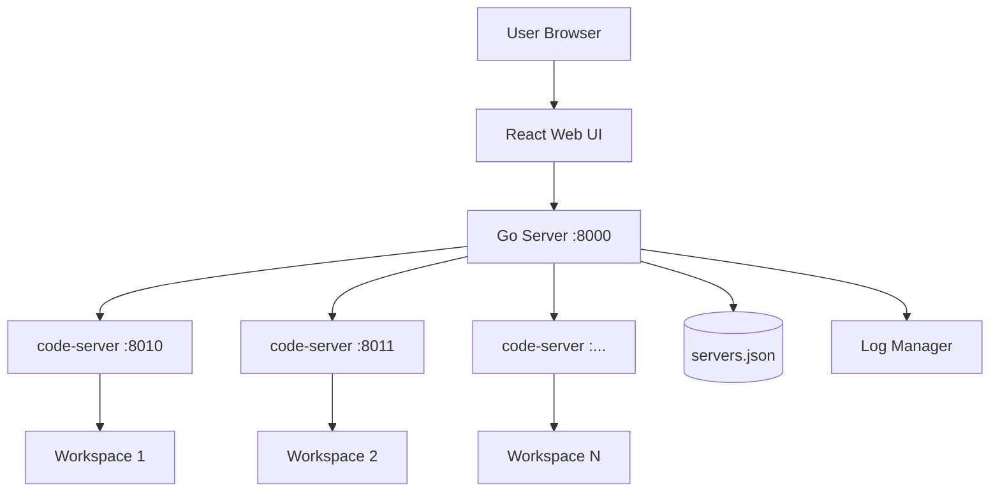

---
hide:
  - navigation
  - toc
---

# Databricks DevBox

Welcome to **Databricks DevBox** - a powerful web-based development environment management platform that brings VS Code to your browser, powered by code-server and optimized for Databricks workflows.

## What is Databricks DevBox?

Databricks DevBox is a Go-based server application that manages multiple code-server instances, allowing you to create isolated development environments with custom extensions, configurations, and workspace setups. It's designed to be deployed as a Databricks Lakehouse App, providing developers with instant access to cloud-based IDEs directly within their Databricks workspace.

## Key Features

### **Instant Development Environments**
Create and launch isolated code-server instances in seconds with pre-configured extension groups for Python, Jupyter, Databricks, and more.

### **AI-Powered Coding Assistants**
Built-in support for multiple vibe coding tools:

- **Claude Code**: Anthropic's AI coding assistant
- **Claude Code Router (CCR)**: Proxy for Databricks-hosted AI models
- **OpenAI Codex**: GitHub Copilot-style code completion
- **Google Gemini**: Google's generative AI assistant

### **Workspace Templates**
Quick-start templates for common scenarios:

- Databricks Workshops
- Python Data Science projects
- Machine Learning experiments
- Custom GitHub repository cloning

### **Real-time Monitoring**
Track server health, CPU usage, memory consumption, and uptime for all running instances through a modern React-based UI.

### **Enterprise Security**
- Databricks SDK authentication
- Auto-generated tokens with configurable expiry
- Unity Catalog integration
- Isolated workspaces per instance

## Architecture Overview



The system consists of three main components:

1. **Go Server** (`databricks_devbox_go/`): Core server managing code-server processes, routing, and lifecycle
2. **Python Wrapper** (`app/`): Handles Databricks App deployment, token management, and vibe coding tools setup
3. **Web UI** (`web_ui/`): React-based interface for managing servers

## Quick Start

### As a Databricks App

1. Copy the `app/` folder to your Databricks workspace
2. Create a Databricks App from the workspace
3. The app automatically downloads required binaries (Go server, code-server, Databricks CLI)
4. Access the UI through your Databricks App URL

[Detailed Installation Guide →](installation/databricks-app.md)

### Local Development

```bash
# Clone the repository
git clone https://github.com/stikkireddy/databricks-devbox.git
cd databricks-devbox

# Install dependencies
make install

# Run the server
make run

# Access at http://localhost:8000
```

[Local Setup Guide →](installation/local-setup.md)

## Use Cases

### 1. **Training & Workshops**
Deploy pre-configured development environments for Databricks training sessions with all required extensions and sample code.

### 2. **Remote Development**
Provide team members with consistent, cloud-based IDEs that work from any device with a browser.

### 3. **AI-Assisted Coding**
Leverage multiple AI coding assistants (Claude Code, Codex, Gemini) within your development environment.

### 4. **VS Code-Like Development**
Full-featured IDE environment with extensions, terminal, debugging, and Git integration - not limited to notebooks.

## What Makes It Different?

### Not VS Code Desktop

Databricks DevBox uses **code-server**, which is an open-source fork of VS Code that runs in the browser. This means:

- **Web-based**: Access from any device
- **No installation**: Works immediately in browser
- **Remote execution**: Code runs on server
- **Different marketplace**: Uses Open VSX instead of Microsoft's marketplace

[Learn more about code-server →](code-server/index.md)

### Multi-Instance Management

Unlike running a single code-server instance, Databricks DevBox:

- Manages multiple isolated instances
- Provides dynamic port allocation
- Includes health monitoring and auto-restart
- Offers a web UI for lifecycle management

## Next Steps

<div class="grid cards" markdown>

- :material-rocket-launch: **[Installation](installation/databricks-app.md)**

    Deploy to Databricks or run locally

- :material-cog: **[Configuration](configuration/devbox-yaml.md)**

    Customize extension groups and settings

- :material-robot: **[Coding Assistants](coding-assistants/index.md)**

    Set up AI-powered development tools

- :material-api: **[API Reference](api-reference.md)**

    Integrate with REST API

</div>

## Community & Support

- **GitHub**: [stikkireddy/databricks-devbox](https://github.com/stikkireddy/databricks-devbox)
- **Issues**: [Report bugs or request features](https://github.com/stikkireddy/databricks-devbox/issues)
- **Contributions**: Pull requests welcome!

## License

MIT License - see LICENSE file for details.